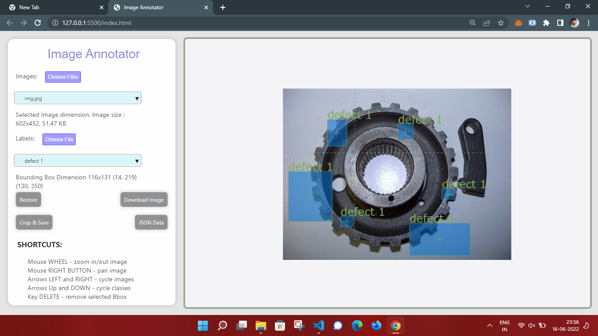

# Annotation Tool
Fast and efficient BBox annotation 

## USAGE
1. Download the zip.
2. Extract it.
3. Open `index.html` in your browser.
4. Load images and classes and start bboxing!

## CONFIGURATION
1. Open index.js.
2. Edit section named `parameters`.

## COMPATIBILITY
All browsers that support ES6 should work. Tested with:

* Chrome v65
* Firefox v58
* Safari v11
* Opera v51

No idea about IE/Edge.

## FEATURES
* Works in your browser on any platform.
* Complete json format support.
* No need for image upload - everything is done locally!
* Zooming and panning images with guidelines for precise bboxing.
* Fast navigation for quick bboxing.
* Auto save in memory in case of accidental refreshes and crashes.
* Ability to crop your bboxes and save the resulting images.
* Information on both image and current bbox.

## CAVEATS
* Loading many and or big images might take a while. This is because tool needs to figure out image dimensions.  
* Cropping many items might crash your browser. This and above will be fixed at some point.
